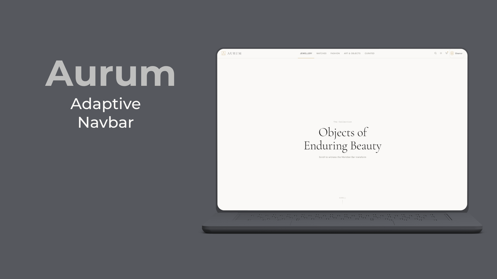

# AURUM — Luxury Marketplace Navigation

> *A precision navigation surface for a luxury marketplace — built in Flutter.*
> When someone sees it for two seconds, they instantly feel: **"this was crafted, not assembled."**

---

&nbsp;

## The Meridian Bar

The navbar is named after a precision surveying instrument. It doesn't decorate — it **orients**. Every visible element has a structural reason. The result reads as a calibrated surface, not a site header.

&nbsp;

<!-- Replace the paths below with your actual screenshots -->
**Desktop View**: 

&nbsp;

---

&nbsp;

## Three Behavioral States

&nbsp;

### 01 — Resting
Full identity. Logo wordmark visible. Category labels readable in uppercase DM Sans. Profile name shown. The system reveals itself completely.


&nbsp;

### 02 — Compressed *(on scroll)*
The wordmark retracts. Category labels morph into italic monogram glyphs — **J · W · F · A · C** — set in Cormorant Garamond. The bar height drops from 64px to 52px. Profile name folds away. Everything contracts inward with spatial efficiency.


&nbsp;

### 03 — Command *(search focused)*
The search lens expands from a 34px circle to a 260px field. Border shifts from neutral to antique gold. The caret color matches the category accent. `⌘K` invokes it from anywhere.


&nbsp;

---

&nbsp;

## The Accent Strip

The most important microinteraction — a **1.5px horizontal line** that slides beneath the active category.

- Moves fluidly between categories via `AnimatedPositioned`
- Changes color per category (gold → steel blue → dusty rose → sage → warm tan)
- Previews on hover, confirms on tap
- Drives the global accent token — search caret, avatar tint, cart badge all follow


&nbsp;

---

&nbsp;

## Mobile — The Bottom Dock

The mobile surface is **not** a collapsed desktop nav. It is a purpose-built floating pill dock designed for thumb navigation on a luxury mobile experience.

| Mobile Resting | Mobile Active |
|---|---|
|  |  |

- Top bar: minimal — menu · wordmark centered · cart
- Bottom dock: floating pill, blur background, 5 items
- Active item: category-tinted background + gold pip above
- Center item: geometric home mark (not a label)

&nbsp;

---

&nbsp;

## Design Tokens

### Color Palette

| Token | Value | Role |
|---|---|---|
| `inkPrimary` | `#0F0E0D` | Primary text |
| `inkSecondary` | `#3A3835` | Secondary text |
| `inkTertiary` | `#7A786F` | Muted labels |
| `inkQuaternary` | `#B8B4AB` | Hints, counts |
| `surfacePrimary` | `#FAF9F7` | Background |
| `surfaceSecondary` | `#F2F0EC` | Elevated surface |
| `surfaceTertiary` | `#E8E5DE` | Borders, dividers |
| `accent` | `#C8A96E` | Antique gold |
| `accentDeep` | `#9B7D4A` | Deep gold |

### Category Accents

| Category | Color | Feeling |
|---|---|---|
| Jewellery | `#C8A96E` | Antique gold |
| Watches | `#8FA8B8` | Steel blue |
| Fashion | `#B8A0A0` | Dusty rose |
| Art & Objects | `#9AA89A` | Sage |
| Curated | `#C0A882` | Warm tan |

### Typography

| Role | Font | Weight | Size |
|---|---|---|---|
| Logo wordmark | Cormorant Garamond | 300 | 19px |
| Nav glyph | Cormorant Garamond Italic | 300 | 16px |
| Nav label | DM Sans | 400 | 11.5px |
| Panel item | DM Sans | 400 | 13px |
| Metadata / counts | DM Mono | 300 | 9px |

### Animation Rhythm

| Name | Duration | Usage |
|---|---|---|
| `fast` | 180ms | Hover, color, press |
| `mid` | 320ms | Height, opacity |
| `slow` | 500ms | Width, strip slide |
| Curve | `easeInOutQuart` | Strip, search expand |

&nbsp;

---

&nbsp;

## Architecture

```
lib/
├── main.dart
│
├── core/
│   ├── theme/
│   │   ├── theme.dart               ← barrel export
│   │   ├── app_colors.dart          ← all color tokens
│   │   ├── app_typography.dart      ← Cormorant + DM Sans + DM Mono
│   │   ├── app_transitions.dart     ← named durations & curves
│   │   └── app_theme.dart           ← MaterialApp theme
│   │
│   └── constants/
│       └── nav_categories.dart      ← all category data & panel content
│
└── features/
    ├── navigation/
    │   ├── meridian_bar.dart         ← root navbar widget
    │   │
    │   ├── state/
    │   │   └── navbar_state.dart     ← ChangeNotifier, single source of truth
    │   │
    │   ├── widgets/
    │   │   ├── logo_zone.dart        ← mark + collapsing wordmark
    │   │   ├── nav_center.dart       ← row of NavItems
    │   │   ├── nav_item.dart         ← label ↔ glyph morph
    │   │   ├── accent_strip.dart     ← the living 1.5px line
    │   │   ├── search_lens.dart      ← expanding search field
    │   │   ├── action_zone.dart      ← search + wishlist + cart + profile
    │   │   ├── icon_button_aurum.dart← reusable icon button + badge
    │   │   ├── profile_pill.dart     ← avatar + collapsing name
    │   │   └── category_panel.dart   ← dropdown panel on hover
    │   │
    │   └── mobile/
    │       ├── mobile_topbar.dart    ← minimal mobile top bar
    │       └── bottom_dock.dart      ← floating pill dock
    │
    └── home/
        └── screens/
            └── home_screen.dart      ← demo screen with scroll content
```

&nbsp;

---

&nbsp;

## State Management

A single `NavbarState` (`ChangeNotifier` via Provider) drives the entire navbar. No rebuilds unless state genuinely changes.

```dart
// Scroll drives compression
navbarState.onScroll(scrollOffset);

// Category selection moves the strip + opens panel
navbarState.setCategory(index);

// Search expansion — triggered by tap or ⌘K
navbarState.expandSearch();
navbarState.focusSearch();

// Breakpoint updates switch mobile ↔ desktop layout
navbarState.updateBreakpoint(constraints.maxWidth);
```

&nbsp;

---

&nbsp;

## Responsive Breakpoints

| Breakpoint | Width | Behavior |
|---|---|---|
| Desktop | ≥ 1024px | Full Meridian Bar, all behaviors |
| Tablet | 768–1023px | Always compressed, glyphs only |
| Mobile | < 768px | MobileTopBar + BottomDock |

&nbsp;

---

&nbsp;

## Getting Started

### Prerequisites

- Flutter `>=3.16.0`
- Dart `>=3.0.0`

### Install

```bash
git clone https://github.com/your-username/aurum_nav.git
cd aurum_nav
flutter pub get
```

### Run

```bash
# Web (recommended — full experience)
flutter run -d chrome --web-renderer canvaskit

# Windows desktop
flutter run -d windows

# macOS desktop
flutter run -d macos
```

### Dependencies

```yaml
google_fonts: ^6.1.0   # Cormorant Garamond, DM Sans, DM Mono
provider: ^6.1.2        # State management
```

&nbsp;

---

&nbsp;

## Interaction Details

| Interaction | Behavior |
|---|---|
| Scroll > 60px | Bar compresses, wordmark retracts, labels → glyphs |
| Hover nav item | Accent strip previews position, panel opens |
| Click nav item | Category set, strip confirms, panel stays open |
| Click search icon | Lens expands to 220px, input focuses |
| Focus search | Lens widens to 260px, border turns gold |
| Press `⌘K` / `Ctrl+K` | Opens search from anywhere |
| Press `Esc` | Clears and collapses search |
| Mouse exit panel | Panel fades and slides up |
| Window resize | Breakpoint updates, layout switches |

&nbsp;

---

&nbsp;

## Why This Feels Different

Most navbars **announce** categories. The Meridian Bar **annotates your session.**

- The accent strip is a spatial record of where you are — it doesn't snap, it slides
- Monogram glyphs treat the alphabet as a luxury device, not a fallback icon
- The search expanding from a circle to a lens feels like focusing an optical instrument
- Nothing is decorative — every motion carries semantic weight
- The mobile dock is a first-class surface, not a responsive afterthought

&nbsp;

---

&nbsp;

## License

MIT — use freely, credit appreciated.

---

&nbsp;

*Designed and engineered with precision. Built in Flutter.*
